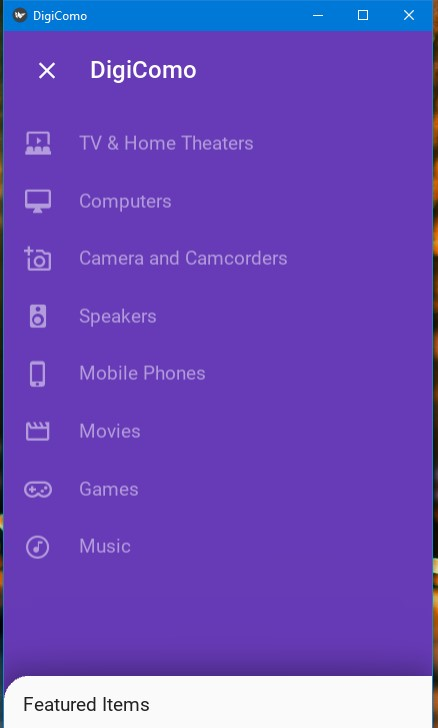
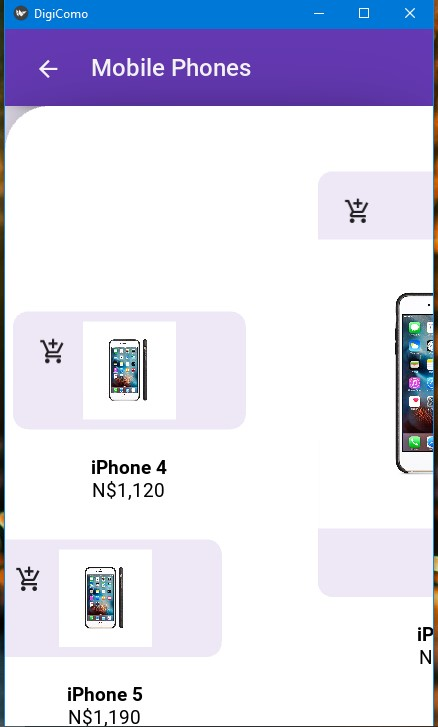

# DigiComo
[DigiComo](https://www.digicomo.com/online-store) conceptual ecommerce application.

## Getting started
Requires Python 3
```
pip install -r requirements.txt
python main.py -m screen:note2,portrait,scale=0.60
```
NB: this project was made in rush to see what I come up with using [MDBackdrop](https://github.com/HeaTTheatR/KivyMD/wiki/Components-Backdrop). Therefore bugs are in there.

## Overview screen


## Backdrop


## Products screen


### Relevant resources
* https://kivy.org
* https://github.com/HeaTTheatR/KivyMD
